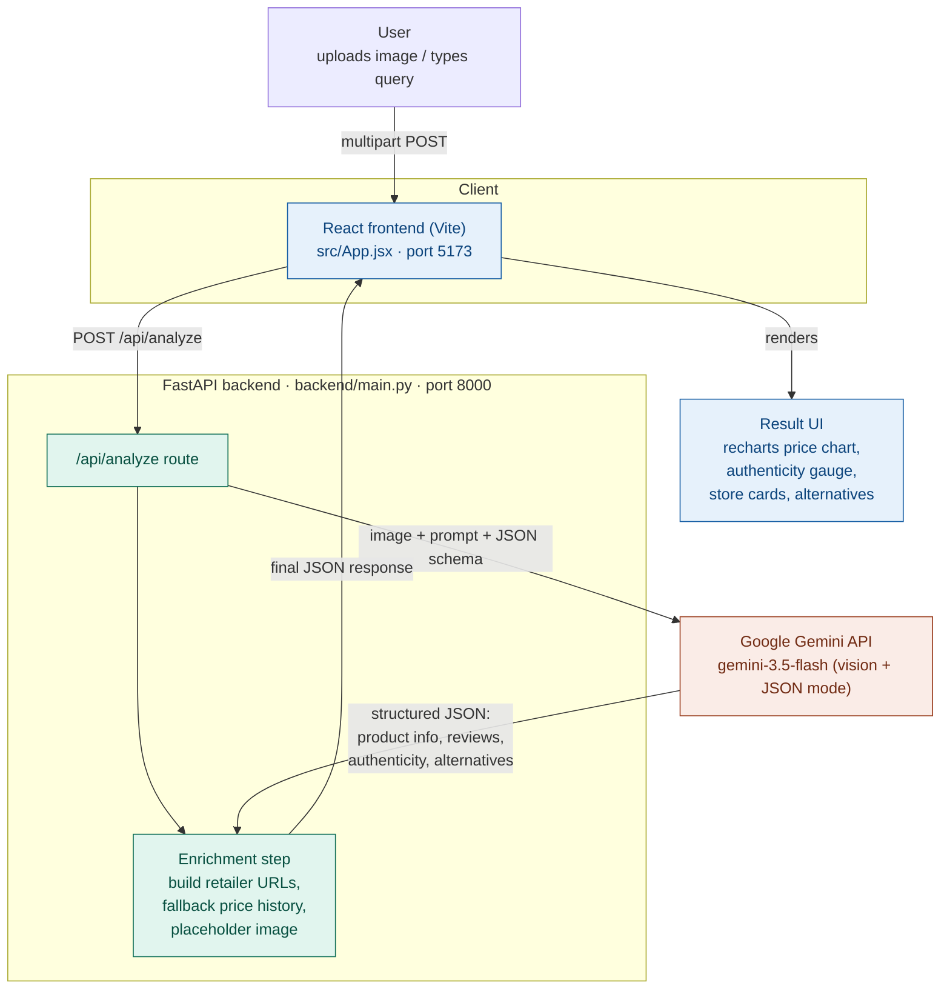

# IntelliBuy

assets/hero.png
---

## Table of contents

- [Overview](#overview)
- [Features](#features)
- [Architecture](#architecture)
- [Tech stack](#tech-stack)
- [Project structure](#project-structure)
- [Getting started](#getting-started)
- [Environment variables](#environment-variables)
- [Running the app](#running-the-app)
- [API reference](#api-reference)
- [How a request flows through the system](#how-a-request-flows-through-the-system)
- [Known limitations](#known-limitations)
- [License](#license)

---

## Overview

IntelliBuy ships in two forms that share the same core idea (send Gemini a product image/text, get back a structured buying report):

1. **Production app** — a React (Vite) frontend talking to a FastAPI backend over a REST endpoint. This is the primary, actively developed app and the one `run.sh` launches.
2. **Standalone prototype** — a single-file Streamlit app (`app.py`) that does the same analysis end-to-end in one process, useful for quick local demos without building the frontend.

Both call the **Gemini API** with a strict JSON schema prompt, so the model itself returns the product name, category, pros/cons, reviews, review-authenticity verdicts, comparable retailer prices, and alternative products in one shot.

## Features

- 📷 **Image or text input** — drop a product photo, type a product name, or ask a specific question ("is this durable?", "what's the battery life?")
- 🧠 **AI product identification** — Gemini Vision identifies the product directly from the photo
- ⭐ **Synthesized reviews** — sample reviews across platforms with star ratings
- 🔍 **Review authenticity scoring** — each review is classified genuine/fake with a confidence score and reasoning
- 🛒 **Multi-retailer price comparison** — Amazon, Best Buy, Walmart, Target with trust scores and live search links
- 📈 **12-month price history** — a seasonally-adjusted price trend chart anchored to the current lowest price
- 💡 **Better alternatives** — competing products with brand, price, and reasoning
- 📦 **Frequently bought together** — accessory suggestions
- 🗨️ **Follow-up questions** — ask something specific about a product you already searched (e.g. "is it waterproof?") without re-uploading the image

## Architecture



**Standalone prototype** (`app.py`) collapses the client and server into a single Streamlit process: it calls Gemini directly and renders the same report with Plotly instead of Recharts. It's a self-contained alternative to the client/server split above, not a third tier of the same running system.

## Tech stack

| Layer | Technology |
|---|---|
| Frontend | React 18, Vite, Recharts (charts), Framer Motion (animation), Lucide (icons) |
| Backend | Python, FastAPI, Uvicorn |
| AI | Google Gemini API (`google-genai` SDK) — vision + structured JSON output |
| Image processing | Pillow (resizes/compresses uploads before sending to Gemini) |
| Prototype UI | Streamlit, Plotly |
| Dev tooling | python-dotenv, python-multipart |

## Project structure

```
IntelliBuy/
├── app.py                  # Standalone Streamlit prototype (self-contained)
├── backend/
│   ├── main.py              # FastAPI app: /api/analyze route, Gemini calls, enrichment
│   └── requirements.txt     # Backend Python dependencies
├── src/
│   ├── App.jsx               # Main React UI (upload, results, charts, review cards)
│   ├── main.jsx               # React entry point
│   └── index.css
├── index.html                # Vite HTML entry
├── vite.config.js            # Dev server + /api proxy to localhost:8000
├── package.json               # Frontend dependencies and scripts
├── run.sh                     # Builds frontend, then runs backend + dev server together
└── LICENSE                    # MIT
```

## Getting started

### Prerequisites

- Node.js 18+ and npm
- Python 3.9+
- A [Gemini API key](https://ai.google.dev/) from Google AI Studio

### Install

```bash
git clone https://github.com/adrshDevs/IntelliBuy.git
cd IntelliBuy

# Frontend dependencies
npm install

# Backend dependencies
python3 -m venv venv
source venv/bin/activate        # Windows: venv\Scripts\activate
pip install -r backend/requirements.txt
```

## Environment variables

Create a `.env` file in the project root:

```env
GEMINI_API_KEY=your_gemini_api_key_here
```

The frontend also reads a build-time variable for where to send API requests:

```env
# .env used by Vite (only needed if the backend isn't on the default proxy target)
VITE_API_URL=http://localhost:8000
```

> The backend loads `.env` from the project root at startup (`backend/main.py`); the Streamlit prototype (`app.py`) also reads the same `.env`.

## Running the app

### Option A — production app (React + FastAPI), recommended

```bash
chmod +x run.sh
./run.sh
```

This builds the React app, then starts:
- the FastAPI backend at `http://localhost:8000` (serving `/api/analyze` and, once built, the static frontend)
- the Vite dev server at `http://localhost:5173` (proxies `/api` calls to port 8000)

Open **http://localhost:5173** during development, or **http://localhost:8000** to hit the backend serving the production build directly.

### Option B — standalone Streamlit prototype

```bash
source venv/bin/activate
pip install streamlit plotly pandas
streamlit run app.py
```

Opens at `http://localhost:8501` by default.

## API reference

### `POST /api/analyze`

Analyzes a product from an image, text, or both, and returns a structured buying report.

**Request** — `multipart/form-data`

| Field | Type | Required | Description |
|---|---|---|---|
| `image` | file | No | Product photo (jpg/jpeg/png/webp) |
| `prompt` | string | No | Product name, search query, or a follow-up question about a previously analyzed image |

At least one of `image` or `prompt` must be provided.

**Response** — `200 OK`, JSON body (abridged):

```json
{
  "product_name": "string",
  "category": "string",
  "specific_answer": "string",
  "rating": 8.5,
  "worth_buying": true,
  "average_price": 199.99,
  "key_features": ["..."],
  "pros": ["..."],
  "cons": ["..."],
  "reviews": [{ "user": "...", "platform": "...", "text": "...", "rating": 5 }],
  "platforms": [{ "name": "Amazon", "trust_score": 9.5, "price": 199.99, "url": "..." }],
  "price_history": [{ "date": "2025-08", "price": 249.99 }],
  "better_alternatives": [{ "name": "...", "brand": "...", "price": 179.99, "url": "...", "reason": "..." }],
  "review_authenticity": {
    "genuine_count": 3,
    "fake_count": 1,
    "confidence_score": 75,
    "summary": "...",
    "per_review": [{ "user": "...", "verdict": "genuine", "reason": "..." }]
  },
  "product_image_url": "string | null"
}
```

**Errors**

| Status | Cause |
|---|---|
| `500` | `GEMINI_API_KEY` missing, or the Gemini call failed |
| `429` | Gemini vision quota exhausted and no text fallback was provided |

## How a request flows through the system

1. The user uploads an image and/or types a prompt in the React UI.
2. The frontend sends a `multipart/form-data` request to `POST /api/analyze`.
3. The backend (`backend/main.py`) downsizes and compresses any uploaded image with Pillow, then sends it — along with a detailed JSON-schema instruction prompt — to Gemini (`gemini-3.5-flash`) in JSON response mode.
4. Gemini returns one JSON object containing the product identification, pros/cons, sample reviews, per-review authenticity verdicts, retailer prices, and alternative products.
5. The backend enriches that JSON: it builds real search URLs per retailer, fills in a synthesized 12-month price history if Gemini's is too short, and (for text-only searches) attaches a placeholder product image.
6. The enriched JSON is returned to the frontend, which renders the price chart (Recharts), the review-authenticity gauge, retailer cards, and alternative-product cards.
7. Follow-up questions about the same product reuse the existing image and simply send a new `prompt`, letting Gemini decide (`is_new_product`) whether it's a refinement or a brand-new search.

## Known limitations

- Review content and price history are **AI-generated approximations**, not scraped from live retailer data — treat prices and reviews as indicative, not authoritative.
- `backend/main.py` includes a Groq (Llama) fallback path (`call_groq`) that is currently **not wired into** the active `call_llm` code path, and the `groq` package isn't listed in `backend/requirements.txt`.
- Retailer links are generated search URLs, not direct product-page links, since no retailer API is integrated.
- No persistence layer — every search is stateless and nothing is saved between sessions.

## License

MIT — see [LICENSE](./LICENSE).
